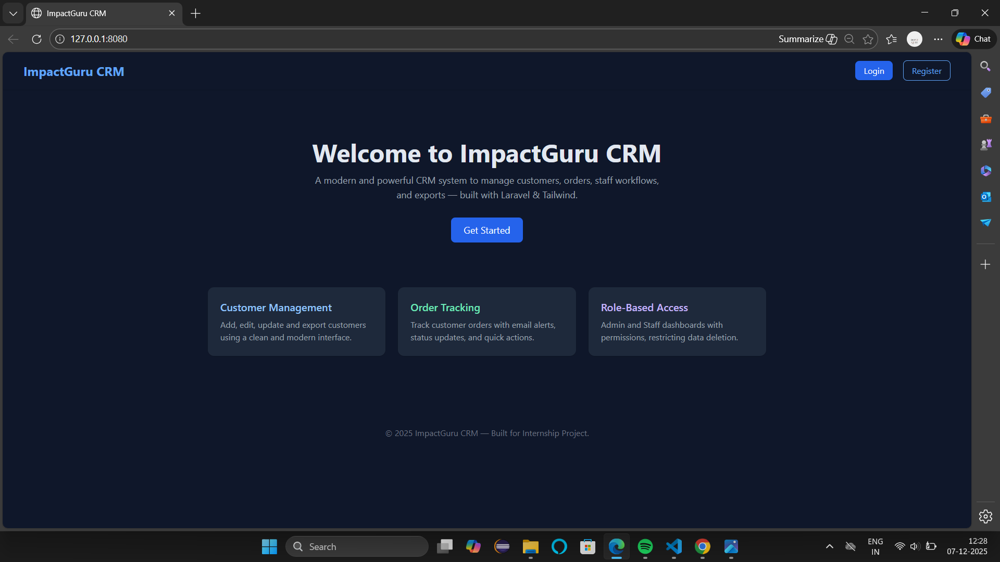
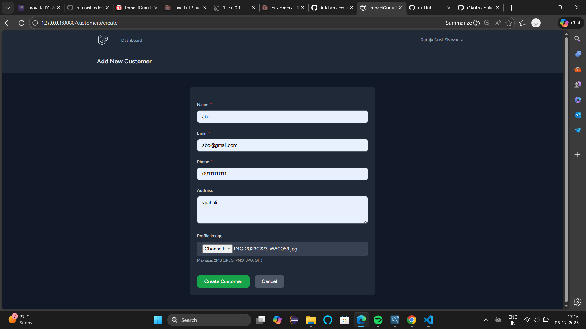
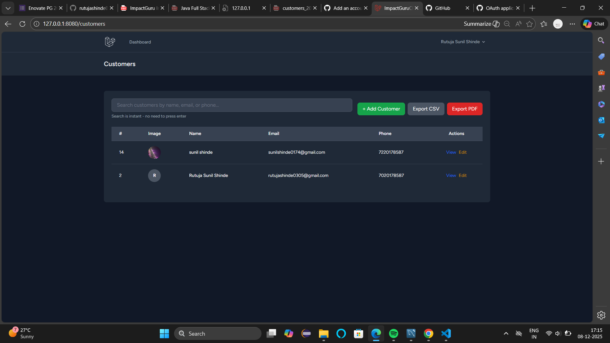
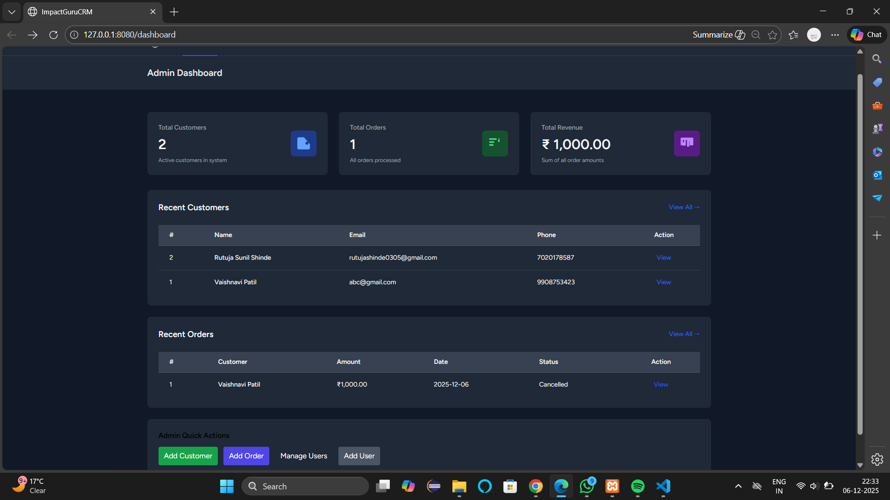
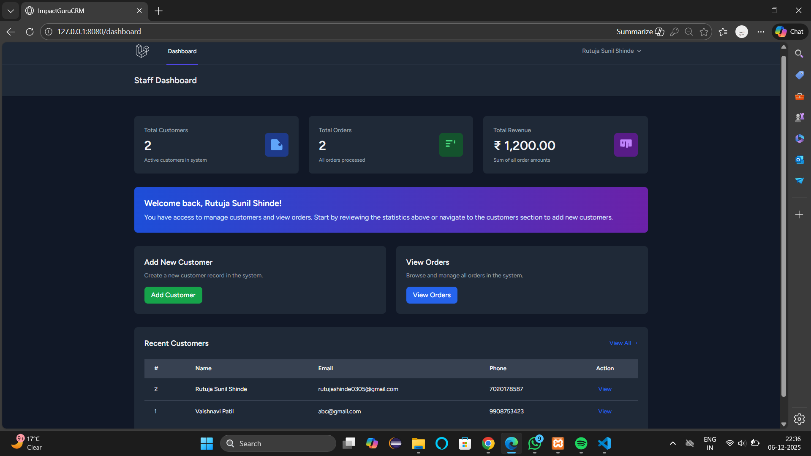

# ImpactGuru Mini CRM

Project Description
-------------------
ImpactGuru Mini CRM is a lightweight customer & order management application built with Laravel and Blade. It provides basic CRM functionality for managing customers, orders, notifications (in-app), file uploads (profile images), PDF export, and a small role-based admin interface.

Installation Steps
------------------
1. Clone the repository:

	git clone https://github.com/rutujashinde0305/-ImpactGuru-Mini-CRM-A-Customer-Management-System
	cd impactguru-crm

2. Install PHP and JS dependencies:

	composer install
	npm install

3. Environment setup:

	cp .env.example .env
	php artisan key:generate
	Configure your database and other settings in `.env` (DB_*, MAIL_*, QUEUE_CONNECTION, etc.)

4. Run migrations & seeders:

	php artisan migrate --seed

5. Prepare storage and assets:

	php artisan storage:link
	npm run build   # or `npm run dev` for development

6. Run the app locally:

	php artisan serve

Feature List
------------
- Customers: create, read, update, soft-delete, restore, force-delete
- Orders: create, read, update, delete, CSV/PDF export
- Notifications: in-app database notifications shown as toast popups for admins
- Profile images: upload and display on user/customer profiles
- Role-based access control: Admin and Staff roles with different permissions
- Simple API endpoints for customers/orders (sanctum-protected where applicable)

Role Permissions Summary
------------------------
- Admin:
  - Full access to all features
  - Can delete customers and orders, manage users, view notifications

- Staff:
  - Can view/create/edit customers and orders
  - Cannot perform destructive actions like deletion or user management

- Authenticated User (default):
  - Can view their permitted resources; login required for most app pages

Notes
-----
- Email sending may require provider credentials (Gmail requires an App Password if using SMTP).
- Queues are configured via `QUEUE_CONNECTION` in `.env`. For development `sync` is convenient.

If you need the more detailed documentation that was previously in `README_DETAILED.md`, it's been consolidated here. If you'd like additional sections (API docs, deployment steps, or examples), tell me what to include.

# 📸 Screenshots

## 🏠 Homepage

## 🧑‍💼 Add New Customer

## 📋 Customers List

## 📦 Create New Order

## 🧾 Orders List

## 🧾 Orders List admin

## 📊 Admin Dashboard

## 👨‍💼 Staff Dashboard

---

## 📂 Database Dump
Include `database.sql` (export via phpMyAdmin / mysqldump).
